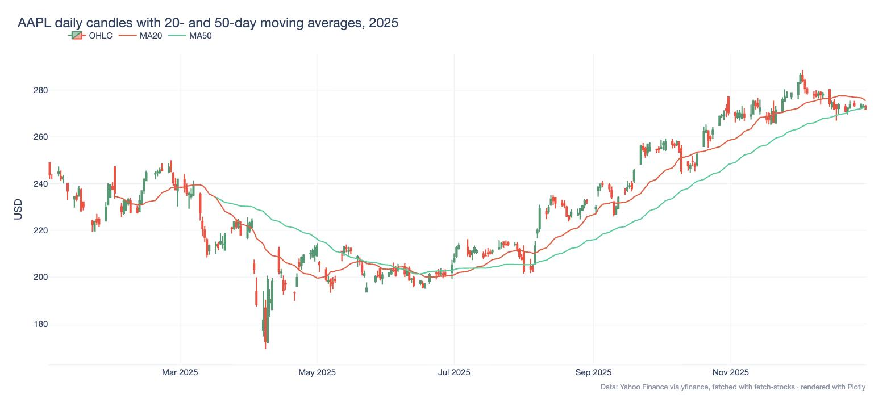

# Quant Stock Fetcher

A small Python CLI that downloads historical OHLCV data from Yahoo Finance (via [yfinance](https://github.com/ranaroussi/yfinance)), stores one Parquet file per ticker, writes a summary CSV of the date ranges, and plots candlestick charts with moving averages.



## Install

Requires Python 3.9+.

```bash
git clone https://github.com/ErenCAkpinar/quant-stock-fetcher.git
cd quant-stock-fetcher
python -m venv .venv
source .venv/bin/activate    # Windows: .venv\Scripts\activate
pip install -r requirements.txt
pip install -e .
```

## Fetch data

List one ticker per line in a text file (the included `tickers.txt` has AAPL, MSFT, SPY and TSLA), then run:

```bash
fetch-stocks -t tickers.txt --start 2025-01-01 --end 2026-01-01 --out-dir data
```

| Option | Default | Meaning |
|---|---|---|
| `-t`, `--tickers-file` | required | Text file with one ticker per line |
| `--start`, `--end` | none | Date range as `YYYY-MM-DD`; the end date is exclusive |
| `--interval` | `1d` | Bar size passed to yfinance (`1d`, `1h`, `1m`, …) |
| `--out-dir` | `data` | Folder for the Parquet files and `summary.csv` |
| `--force` | off | Download again even if the ticker's file already exists |

Tickers that already have a file are skipped unless `--force` is set. A failed or empty download is retried with exponential backoff, up to five attempts.

## Output

- `data/<TICKER>.parquet`: one row per bar with columns `date, open, high, low, close, adj_close, volume, ticker`. Prices are unadjusted; the adjusted close is kept in `adj_close`.
- `data/summary.csv`: the date range and row count for each ticker. From the command above (run on 26 September 2026):

```csv
ticker,start_date,end_date,rows
AAPL,2025-01-02 00:00:00,2025-12-31 00:00:00,250
MSFT,2025-01-02 00:00:00,2025-12-31 00:00:00,250
SPY,2025-01-02 00:00:00,2025-12-31 00:00:00,250
TSLA,2025-01-02 00:00:00,2025-12-31 00:00:00,250
```

## Plot a chart

```python
import pandas as pd
from visualizer import plot_candlestick, save_plot_html

df = pd.read_parquet("data/AAPL.parquet")
fig = plot_candlestick(df, ma_windows=(20, 50))  # candlesticks plus 20- and 50-day moving averages
save_plot_html(fig, "AAPL.html")                  # interactive HTML; plotly.js loads from a CDN
```

The chart at the top of this README uses the same data and moving averages.

## Tests

```bash
pytest
```

## Notes

The data comes from Yahoo Finance through yfinance, an unofficial library, so availability and rate limits are outside this project's control. Check Yahoo's terms before using the data beyond personal research.
